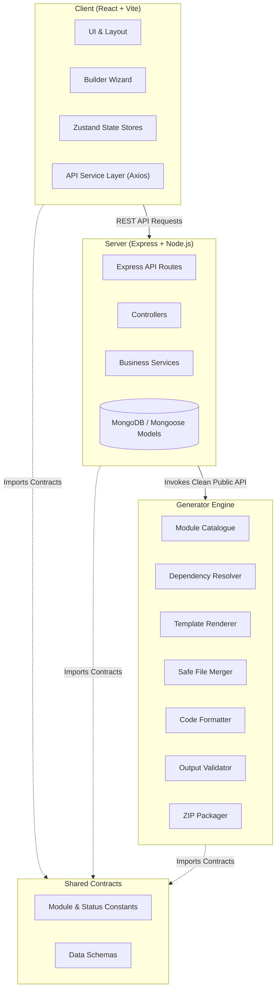
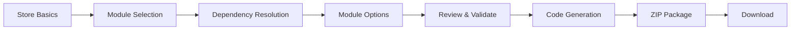

# System Architecture & Technical Specifications

## 1. Overview
The **Autonomous MERN E-Commerce Code Generator** is a platform allowing developers and store owners to configure modular MERN applications and automatically generate, validate, and download complete, production-ready source code repositories.

## 2. High-Level System Architecture

## 3. Separation of Concerns & Isolation Rules
- **Client Isolation**: The client must **NEVER** import server files, database drivers, or generator internals.
- **Generator Isolation**: The generator is completely framework-agnostic and must **NEVER** depend on React or database models.
- **Backend Clean Interface**: The server communicates with the generator solely through the exported `GeneratorEngine` public API.
- **Shared Minimality**: The `shared/` directory contains strictly pure contracts, immutable constants, and schemas. No framework dependencies or heavy business logic.

## 4. End-to-End Generation Pipeline (Future Phases)

