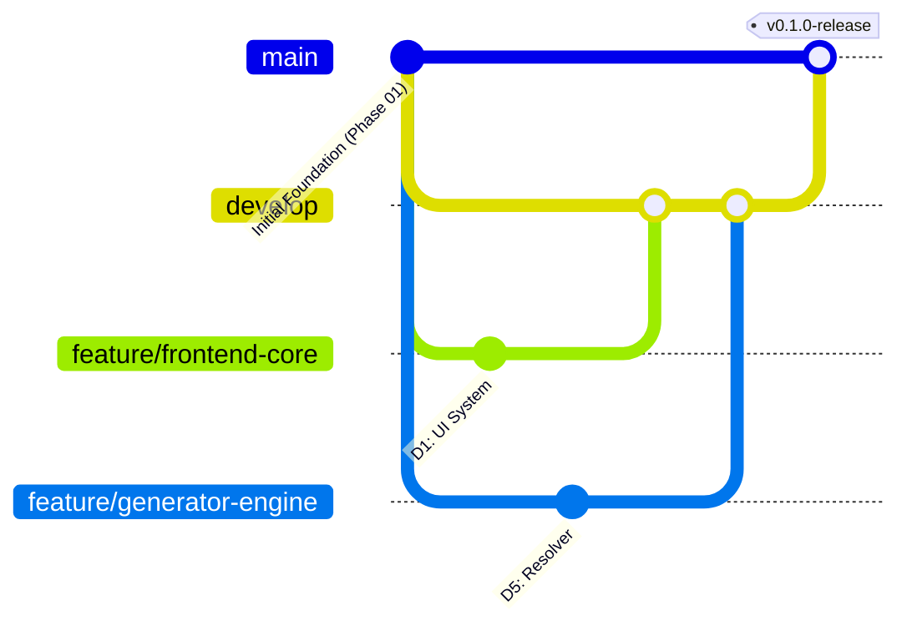

# Git & Collaboration Workflow

## 1. Branch Strategy

### Primary Branches
- **`main`**: Production-ready, stable demo code. Protected branch.
- **`develop`**: Integration branch for merging feature branches.

### Team Feature Branches
- Developer 1: `feature/frontend-core`
- Developer 2: `feature/frontend-builder`
- Developer 3: `feature/backend-auth`
- Developer 4: `feature/backend-api`
- Developer 5: `feature/generator-engine`

## 2. Collaboration Rules
1. **Never force push** to `main` or `develop`.
2. **Never commit secrets** (such as `.env`, keys, or credentials).
3. **Never directly modify another developer's ownership files** without explicit coordination.
4. **Always use Pull Requests (PRs)** targeting `develop`.
5. Require at least one peer code review before merging into `develop`.

## 3. Commit Convention
Follow Conventional Commits:
- `feat(scope): add new capability`
- `fix(scope): resolve bug`
- `docs(scope): update documentation`
- `refactor(scope): internal code restructuring`
- `chore(scope): build, deps, or workflow changes`
